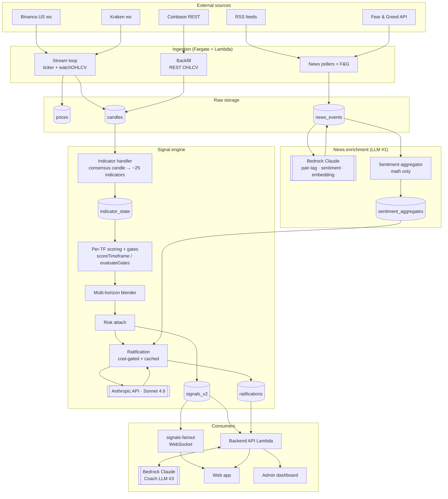

# Data pipeline: exchange → signal → consumer

High-level view of how raw market and news data flows through the
Quantara backend, where it's stored, where the signal engine runs, and
where each LLM call sits. Pairs with `docs/SIGNALS_AND_RISK.md` (engine
semantics) and `docs/diagrams/architecture.excalidraw` (full
infrastructure diagram).

## Quick read (ASCII)

```
┌─────────────────────────────────────────────────────────────────┐
│  EXTERNAL SOURCES                                               │
├─────────────────────────────────────────────────────────────────┤
│  Binance.US   Coinbase   Kraken    RSS feeds   Fear&Greed API   │
│  (ccxt.pro)   (REST)     (ccxt.pro)                             │
└──────┬───────────┬──────────┬──────────┬───────────┬────────────┘
       │           │          │          │           │
       ▼           ▼          ▼          ▼           ▼
┌─────────────────────────────────────────────────────────────────┐
│  INGESTION (Fargate + Lambda)                                   │
├─────────────────────────────────────────────────────────────────┤
│  • Stream loop (ws ticker + watchOHLCV)   → prices, candles     │
│  • Backfill (REST OHLCV)                  → candles             │
│  • News pollers + F&G                     → news_events (raw)   │
└──────┬─────────────────────────────────────────────┬────────────┘
       │                                             │
       │                                             ▼
       │                              ┌──────────────────────────┐
       │                              │  NEWS ENRICHMENT (LLM)   │ ◀── Bedrock
       │                              │  pair-tag + sentiment    │     (Claude)
       │                              │  + embedding (dedup)     │
       │                              └──────────┬───────────────┘
       │                                         ▼
       │                              ┌──────────────────────────┐
       │                              │ SENTIMENT AGGREGATOR     │
       │                              │ (no LLM — math only)     │
       │                              │ → sentiment_aggregates   │
       │                              └──────────┬───────────────┘
       ▼                                         │
┌─────────────────────────────────────────────┐  │
│  INDICATOR ENGINE (Lambda, per-bar)         │  │
│  consensus candle → ~25 indicators          │  │
│  (RSI, MACD, EMA, ATR, BB, OBV, vol-Z, …)   │  │
│                          → indicator_state  │  │
└──────────────┬──────────────────────────────┘  │
               ▼                                 │
┌─────────────────────────────────────────────┐  │
│  PER-TF SCORING + GATES  (pure functions)   │  │
│  scoreTimeframe()  → TimeframeVote per TF   │  │
│  evaluateGates()   → vol/dispersion/stale   │  │
└──────────────┬──────────────────────────────┘  │
               ▼                                 │
┌─────────────────────────────────────────────┐  │
│  MULTI-HORIZON BLENDER (pure)               │  │
│  weights {1m:0, 5m:0, 15m:.15, 1h:.20,      │  │
│           4h:.30, 1d:.35} → BlendedSignal   │  │
└──────────────┬──────────────────────────────┘  │
               ▼                                 │
┌─────────────────────────────────────────────┐  │
│  RISK ATTACH (pure)                         │  │
│  → BlendedSignal.risk: RiskRecommendation   │  │
└──────────────┬──────────────────────────────┘  │
               ▼                                 │
┌─────────────────────────────────────────────┐  │
│  RATIFICATION (LLM)  ◀── Anthropic API      │  │
│  Sonnet 4.6 reviews signal + context        │  │
│  (sentiment_aggregates ◀───────────────┐)   │  │
│  cost-gated + cached                   │    │  │
│                  → ratifications  table│    │  │
└──────────────┬─────────────────────────┴────┘  │
               ▼                                 │
┌─────────────────────────────────────────────┐  │
│  PERSISTENCE                                │ ◀┘
│  signals_v2  (BlendedSignal + risk)         │
│  ratifications  (LLM verdict)               │
│  (90-day TTL on signals_v2)                 │
└──────────────┬──────────────────────────────┘
               │
       ┌───────┴───────────────┐
       ▼                       ▼
┌────────────────┐    ┌────────────────────────┐
│ FANOUT (WS)    │    │ BACKEND API (Lambda)   │
│ signals-fanout │    │ /genie  read signals   │
│ → connected    │    │ /coach  chat ◀── LLM   │ ◀── Bedrock
│   clients      │    │ /admin  dashboards     │     (Coach)
└───────┬────────┘    └────────┬───────────────┘
        ▼                      ▼
       Web app              Admin dashboard
```

## Mermaid (rendered version)



## The three LLM call sites

| # | Where | Model | What it does | Cadence |
|---|---|---|---|---|
| 1 | `ingestion/src/enrichment/bedrock.ts` | Bedrock (Claude) | Pair-tag a news article, score sentiment, generate embedding for dedup | Per-article on ingest |
| 2 | `ingestion/src/llm/ratify.ts` | Anthropic API direct, Sonnet 4.6 | Reviews each `BlendedSignal` + sentiment context. Cost-gated (only fires when worth it per `SIGNALS_AND_RISK.md` §7.5), cached by content hash, persisted as `RatificationRecord` | Per-signal, after blend |
| 3 | `backend/src/routes/coach.ts` | Bedrock (Claude) | User-facing chat ("why this signal?", coaching) | Per user request |

LLM #1 and #2 are inside the deterministic ingestion pipeline — they
augment the data but the math (indicators, scoring, blending, gates,
risk) is pure and runs without any LLM. The LLM enriches inputs (#1:
news → sentiment) and validates outputs (#2: signal → ratification).
LLM #3 is the user-facing conversational layer, not in the signal path
itself.

## What's persisted

| Table | Owner | Purpose |
|---|---|---|
| `prices` | stream loop | Latest tick per pair × exchange (used for staleness + dispersion gate) |
| `candles` | stream loop + backfill | OHLCV bars per pair × exchange × timeframe |
| `news_events` | news pollers + enrichment | Raw + enriched articles (sentiment, pair tags, embedding) |
| `sentiment_aggregates` | aggregator | Per-pair × window rolled-up sentiment |
| `indicator_state` | indicator handler | Latest IndicatorState per pair × `consensus` × timeframe |
| `signals_v2` | signal engine | BlendedSignal with risk recommendation (90-day TTL) |
| `ratifications` | ratify.ts | LLM verdicts on signals (gated subset) |

## Pure vs. impure boundaries

The signal-engine functions in `ingestion/src/signals/` (score,
gates, blend) and `ingestion/src/risk/` (attach, recommend) are
**pure** — given the same inputs they produce the same outputs, no I/O,
no clocks, no randomness. This is what makes them straightforward to
unit-test without mocks. The orchestration is in the Lambda handlers
(`indicator-handler.ts`, `aggregator-handler.ts`, etc.) which read
from DDB, call the pure functions, and write back.

The two ingestion-side LLM calls (#1 enrichment and #2 ratification)
are the only points where non-determinism enters the data path. Both
are cached and idempotent.
